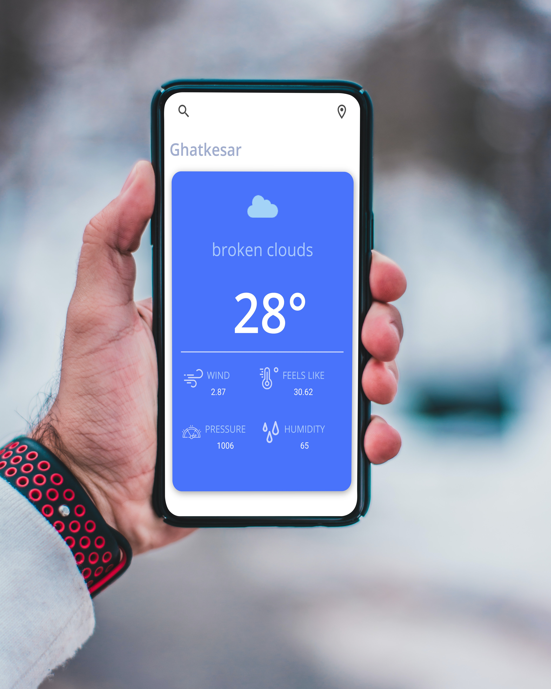
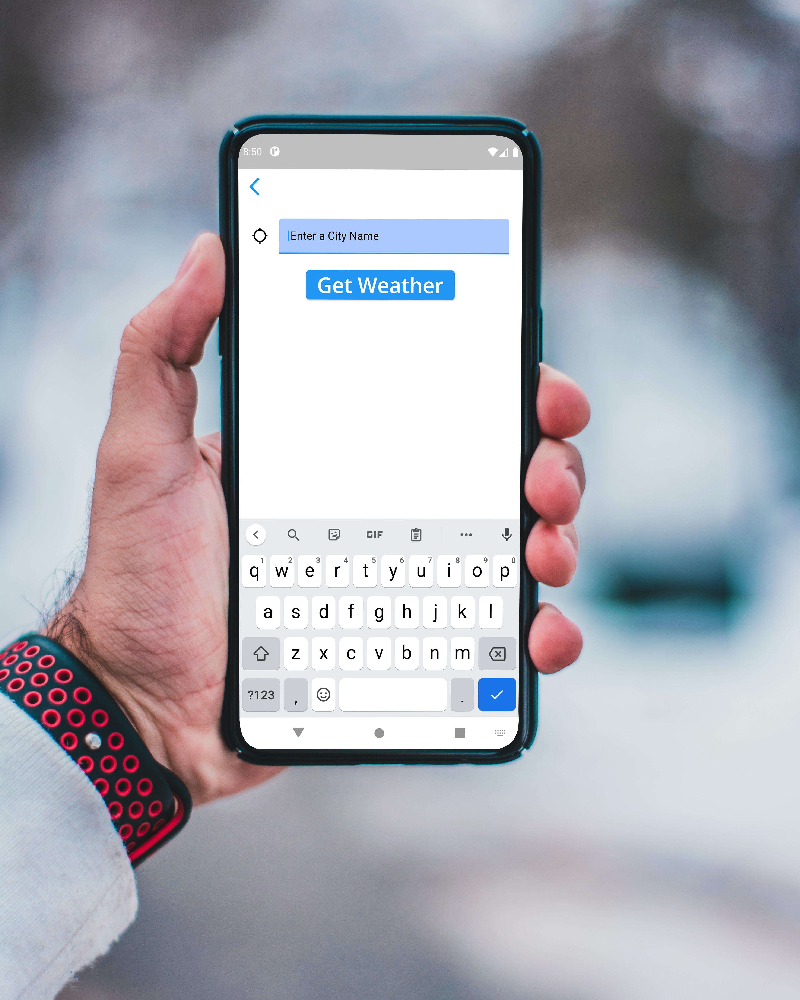

# Feather
## A weather app using flutter

### Snapshots : 



### Working:
1. This app uses Openweathermap API , refer 
2. Live weather data from any location is attributed and presented in a CLean responsive UI
3. Location refresh and searching a city options are provided along with the UI

### Flutter packages used : 
```
 Geolocator
 Sizer(for responsive widgets)
 Http 
 Flutter Spinkit
```

### To Use
Download the .apk files which will be uploaded soon
### To run on IDE:
Clone this repository
In android studio, 
```
pub get

```

Now run on any preffered device


## Contributions
Please provide any help/correction in the code base, feel free to ping me and It would really help if anyone of you can make this app better. 
